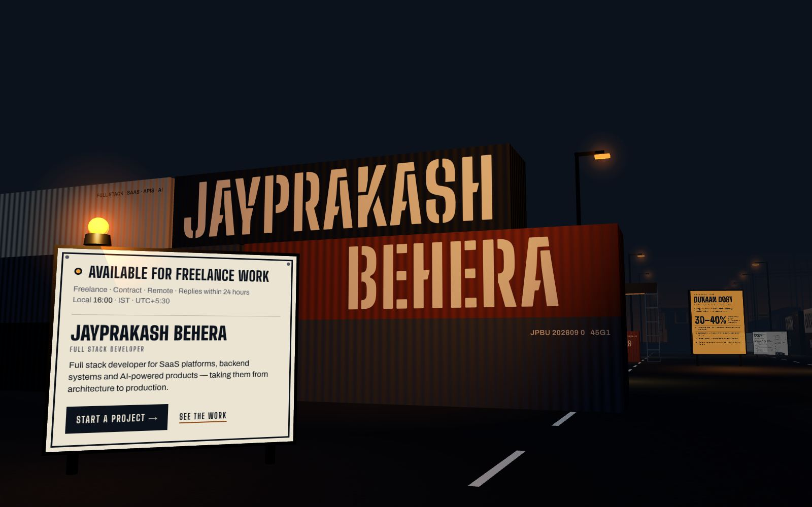
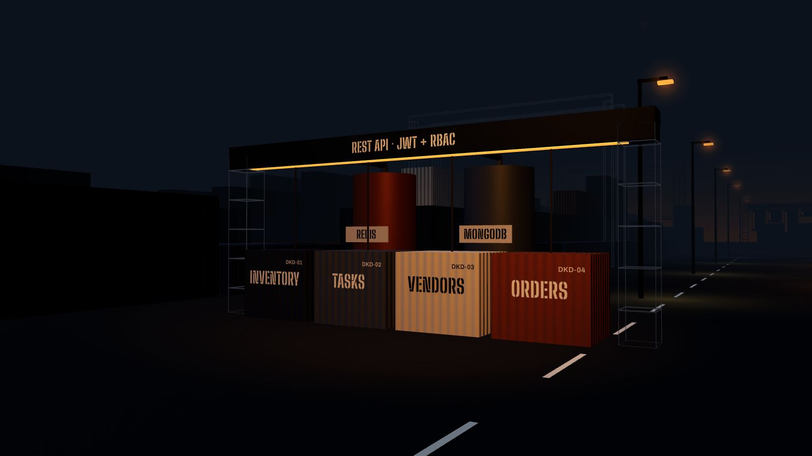
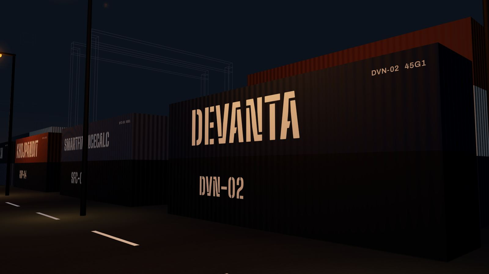
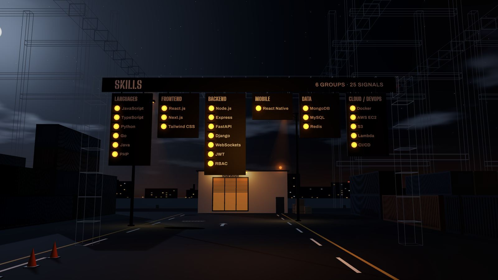
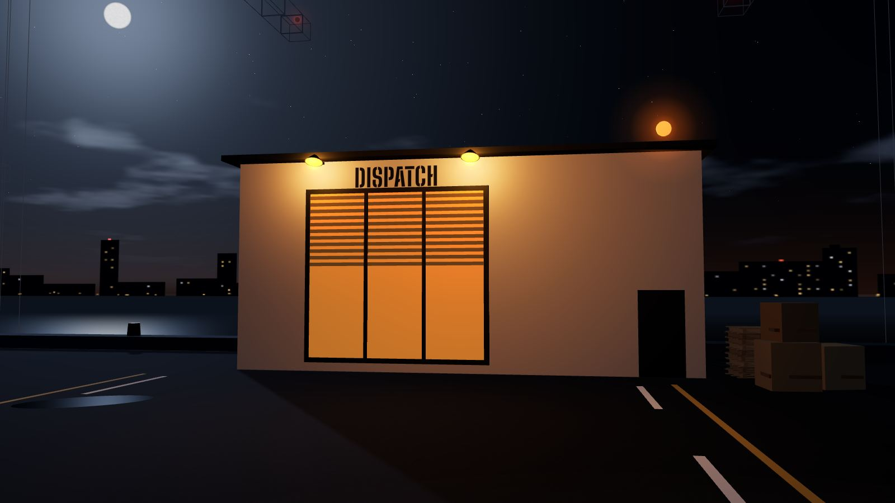
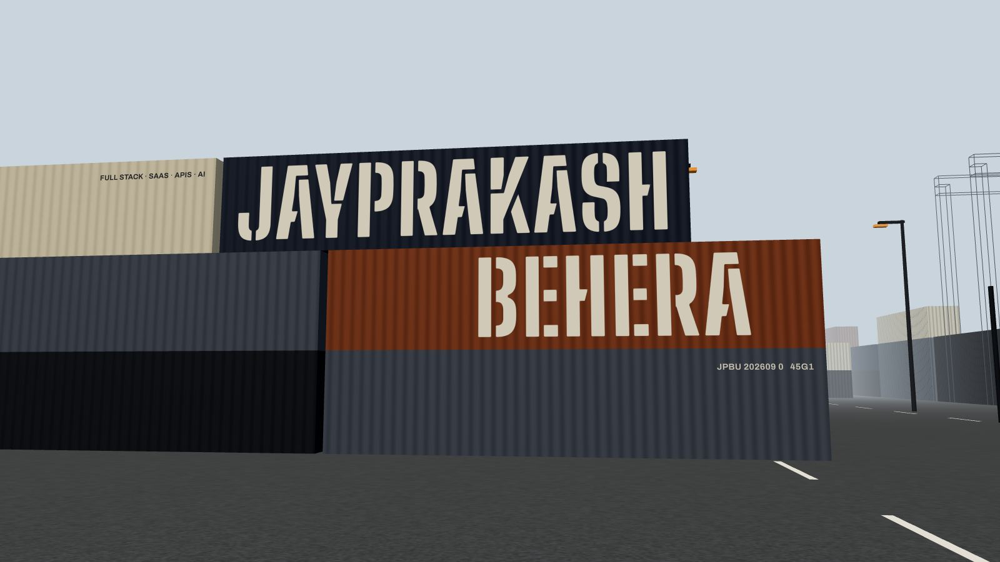

<div align="center">


# JAYPEE

**Jayprakash Behera — Full Stack Developer**
<br />
SaaS platforms · backend systems · AI-powered products, from architecture to production.

**[jaypee-2003.github.io/jaypee](https://jaypee-2003.github.io/jaypee)** &nbsp;·&nbsp; Available for freelance & contract work

[](https://github.com/Jaypee-2003/jaypee/actions/workflows/deploy.yml)

</div>

<br />



## Night shift at the terminal

This portfolio is a place, not a page. The whole site is **one continuous 3D scene**: a container terminal at night. Scrolling drives a camera down the lane in a single dolly shot. The content isn't laid over a backdrop. It stands in the yard as things you'd actually find there:

- your name stencilled on steel
- a notice board and a lightbox
- a row of container stacks with their manifests
- a signal gantry
- the dispatch office at the end of the quay

Each sign is real HTML set into 3D space, so it has depth, perspective and scale, and it disappears behind whatever stands in front of it.

## The route

| # | Stop | What stands there | Section |
|:-:|------|-------------------|---------|
| 01 | **The gate** | The name on a floodlit container stack. The gate sign carries the availability status under a live amber lamp. | `#/` |
| 02 | **Notice board** | Portrait, summary, and how the work splits between architecture and delivery. | `#/about` |
| 03 | **Loading bay** | The Dukaan Dost case study, with the architecture built full size (see below). | `#/experience` |
| 04 | **Project row** | One container stack per project with its name painted on the steel and a paper manifest on a board in front: EduExamine, Devanta, SmartFinanceCalc, KhojPandit, CleanDirty.ai. | `#/projects` |
| 05 | **Signal gantry** | Skills: one signal head per group, one lit lamp per skill. | `#/skills` |
| 06 | **Dispatch office** | Hire details on the window, the contact form as an order slip, education on a plaque. | `#/contact` |

At the loading bay, four module containers (Inventory, Tasks, Vendors, Orders) hang from one `REST API · JWT + RBAC` gantry, piped into Redis and MongoDB tanks. An amber lightbox beside them carries the case study, including the 30–40% API gain.

The nav, links and URLs jump the camera to a stop, and the URL follows you as you scroll. Keyboard focus follows the route too: tabbing into a sign brings the camera to it.

<table>
  <tr>
    <td width="50%"></td>
    <td width="50%"></td>
  </tr>
  <tr>
    <td width="50%"></td>
    <td width="50%"></td>
  </tr>
</table>

## Night shift or day shift

The sun/moon switch in the nav changes the time of day across the whole site, and your choice is remembered.

- **3D view:** the yard itself changes.
  - **Night:** a navy sky, fog and a low moon. Everything warm comes from sodium street lamps and floodlights.
  - **Day:** a hazy sky, a high sun and real surface colours. The street lamps and floodlights switch off, but the signal lamps and the live status lamp stay lit, because those are signals.
  - Switching fades like a dusk or a dawn over about a second.
- **Plain view:** a dark theme and a light "paper" theme. Each place's photograph is shown by night or by day to match.

<table>
  <tr>
    <td width="50%"></td>
    <td width="50%"></td>
  </tr>
</table>

## The look

Three colours, each used for what it is in the yard. None of them are decoration.

| | Colour | Hex | Used for |
|---|--------|-----|----------|
| ◼ | **Ink** | `#0B121C` | The night: page, sky and fog, plus dark enamel and window glass |
| ◻ | **Bone** | `#ECE4D2` | Paint, paper and enamel: anything that carries words |
| ● | **Sodium amber** | `#F0A13A` | Light: lamps, the lightbox, the live status. Copper `#8F4A14` is its dark shade on bone. |

- **Type:**
  - [Big Shoulders Display](https://fonts.google.com/specimen/Big+Shoulders+Display) for condensed industrial capitals. Its stencil cut is the paint on the containers.
  - [Archivo](https://fonts.google.com/specimen/Archivo) for reading.
- **Materials:** cargo is matte corrugated steel, lamps are emissive with real point lights and spotlights, and crane lattice is drawn as wireframe. Glow comes from light in the scene, not CSS shadows.
- **Surfaces:** every sign is a solid physical object: enamel, steel, a lightbox, paper, a lit window. Nothing is translucent or blurred.

## How it works

| Layer | What it does |
|-------|--------------|
| **Scroll rig** (`src/scene/rig.ts`, `CameraRig.tsx`) | Page scroll maps to a point on a Catmull-Rom camera path. Each stop has a rest zone where the camera holds still, travel between stops eases in and out, and the camera damps toward its target so it glides instead of jumping. It uses native scroll, so wheel, touch, keyboard and scrollbars all behave normally. |
| **Signs** (`src/scene/Placard.tsx`, `src/content/*`) | drei `<Html transform occlude="blending">`: real DOM mapped onto a plane with CSS 3D. Geometry in front of a sign genuinely hides it, and it fades with distance like the fog. Each sign is portalled into a slot in route order, so reading and tab order follow the walk. |
| **Paint** (`src/scene/Paint.tsx`) | Names and markings are real 3D text (troika SDF), lit by the scene's lamps and fogged with distance. |
| **The yard** (`src/scene/Environment.tsx`, `locations/*`) | Instanced background stacks (one draw call), merged lamp poles and lane paint, wireframe cranes, the quay and a sodium glow on the horizon. |
| **Plain view** (`src/document/DocumentSite.tsx`) | The same content as an ordinary scrolling page, laid out like a photo essay: a photograph of each place, with its signs set as readable text beside it. |

### Plain view and accessibility

The 3D yard runs on roomy desktop screens with a fine pointer. Everyone else gets the plain view:

- phones and tablets
- visitors with `prefers-reduced-motion`
- low-end hardware or data-saver mode
- browsers without WebGL
- anyone who picks **Plain** on the 3D / Plain switch in the nav

The plain view scrolls normally, with no scroll-jacking, and never downloads the 3D code.

In both views, every word is real, selectable text. Headings are in order, links and the form are keyboard-reachable, and the skills gantry has a screen-reader list.

### Performance

- **Downloads:** the main bundle is **~110 kB** gzipped. The 3D scene (three, fiber, drei, troika) is a separate **~263 kB** download that only 3D-view visitors fetch.
- **Rendering:** the scene renders on demand. It draws while the camera moves and stops when it rests. The one exception is the gate, where the status lamp pulses at about 15 fps while it's in shot.
- **Measured** (desktop Chrome): scrolling the full route held 60 fps (median to p99 frame time 16.7–16.8 ms) with no long tasks.

## Project layout

```
src/
├── data/profile.ts        ← all portfolio content lives here (one source for both views)
├── content/               ← the signs: gate sign, notice board, lightbox, manifests, dispatch window, order slip
├── scene/                 ← the 3D yard
│   ├── SceneSite.tsx      ← canvas, scroll track, sign slots, error fallback
│   ├── CameraRig.tsx      ← scroll → camera
│   ├── rig.ts             ← camera path, stop poses, still-photo framing
│   ├── Environment.tsx    ← ground, stacks, lamps, cranes, quay, horizon
│   ├── locations/         ← gate, notice, bay, project row, signals, dispatch
│   └── Placard.tsx · Paint.tsx · props.tsx · palette.ts · textures.ts
├── document/              ← the plain view
├── site/                  ← stops and routes, view mode, active-stop store, URL sync
├── components/Navbar.tsx
└── styles/theme.ts        ← ink · bone · amber, type, layout
scripts/render-stills.js   ← renders the plain view's location photos from the 3D scene
public/stills/             ← those photos by night, and by day in stills/day/ (committed)
```

## Run it locally

Requires Node 20+.

```bash
npm install
npm start          # dev server with hot reload
npm run build      # production build in ./build (the same check CI runs: CI=true npm run build)
```

**Editing content:** everything visible (profile, experience, projects, skills, education, contact) comes from [`src/data/profile.ts`](src/data/profile.ts). Change it there and both views update.

**Changing the 3D scene:** the plain view's location photos are rendered from the scene, not drawn by hand, as a night set (`public/stills/`) and a day set (`public/stills/day/`). After moving the camera, changing a location or adjusting the lighting, re-render both:

```bash
npm run build && npm run stills && npm run build
```

`stills` uses your local Chrome through playwright-core. Set `CHROME_PATH` if it isn't in the default macOS location. Then commit the updated `public/stills/`.

## Deployment

Every push to `main` deploys automatically. The workflow in [`.github/workflows/deploy.yml`](.github/workflows/deploy.yml):

1. installs with `npm ci`
2. builds with `CI=true` (warnings fail the build)
3. publishes `./build` to the `gh-pages` branch

GitHub Pages serves that branch at **[jaypee-2003.github.io/jaypee](https://jaypee-2003.github.io/jaypee)**. You can also rerun it by hand from the Actions tab.

> One-time setup, already done: **Settings → Pages → Source: Deploy from a branch → `gh-pages` / root**.

## Built with

React 18 · TypeScript · three.js · React Three Fiber · drei · Emotion · Framer Motion · React Router · Create React App + CRACO · GitHub Actions / GitHub Pages

---

<div align="center">

**Have a platform to build? Let's scope it.**

[jaypeebehera@gmail.com](mailto:jaypeebehera@gmail.com) &nbsp;·&nbsp; [LinkedIn](https://www.linkedin.com/in/jayprakash-behera-69a212252) &nbsp;·&nbsp; [GitHub](https://github.com/Jaypee-2003)

<sub>© Jayprakash Behera</sub>

</div>
